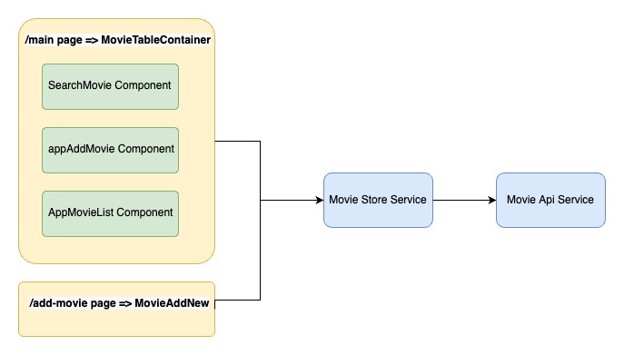
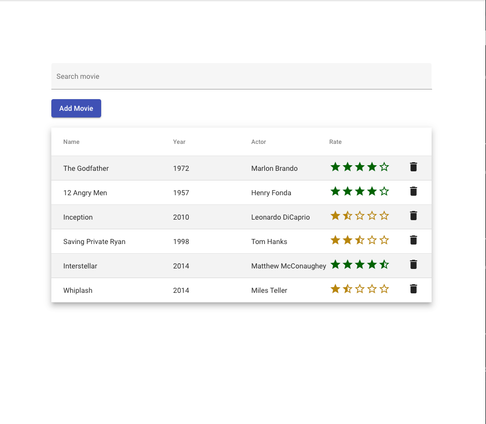
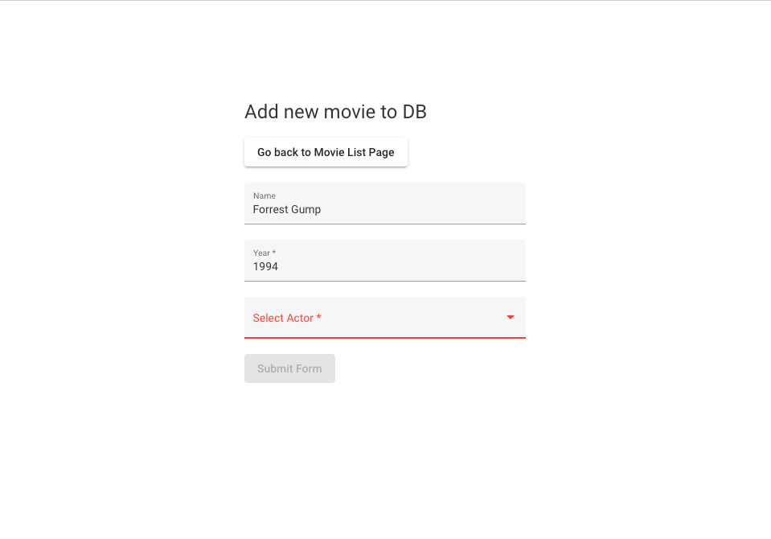

# AngularMovieApp

This project was generated with [Angular CLI](https://github.com/angular/angular-cli) version 14.1.3.

Deployed under:  https://jmgomes.github.io/angular-movie-repo/

# Requirements: 
 - 'Landing page' and 'Add movie' page
 - Rate a movie - by clicking on table row
 - Delete a movie from list - by clicking on the delete icon
 - Search from a movie from list (by name, year or actor)
 - Add a new movie feature on dedicated page

## Technical Decisions:
 - State is maintained from services/movieStoreService
 - movieStoreService is first populated from services/api/movieApiService which mocks a movie db
 - Data is reset uppon page refresh
 - Navigation (RouterModule) is implemented using { useHash: true } due to some issues with github pages configuration
 - Custom pipe implemented used in search feature => `SearchTermFilterPipe`
 - Implemented some slick star review view that translates (1-10) number to a cool star feature
 - Implemented tests for store service class
 - Used material designs since they were mentioned in the test task

## Component Diagram

## Screenshots

## Development server

Run `ng serve` for a dev server. Navigate to `http://localhost:4200/`. The application will automatically reload if you change any of the source files.

## Tests

One test was properly build from the movie store service: 
 - `movie-store.service.spec.ts`

Run `ng test` to execute the unit tests via [Karma](https://karma-runner.github.io).

## Running end-to-end tests

Run `ng e2e` to execute the end-to-end tests via a platform of your choice. To use this command, you need to first add a package that implements end-to-end testing capabilities.